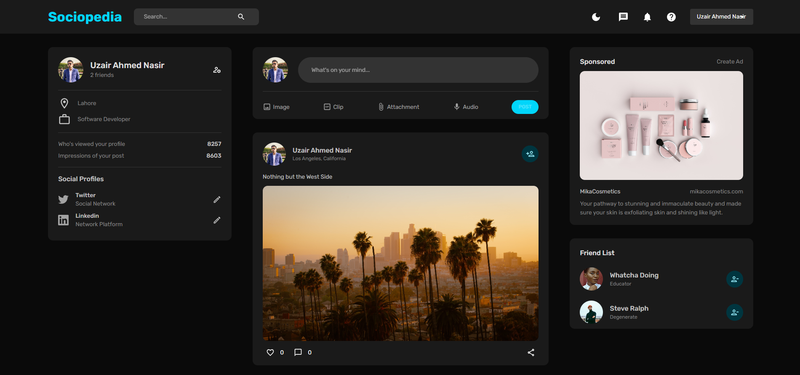
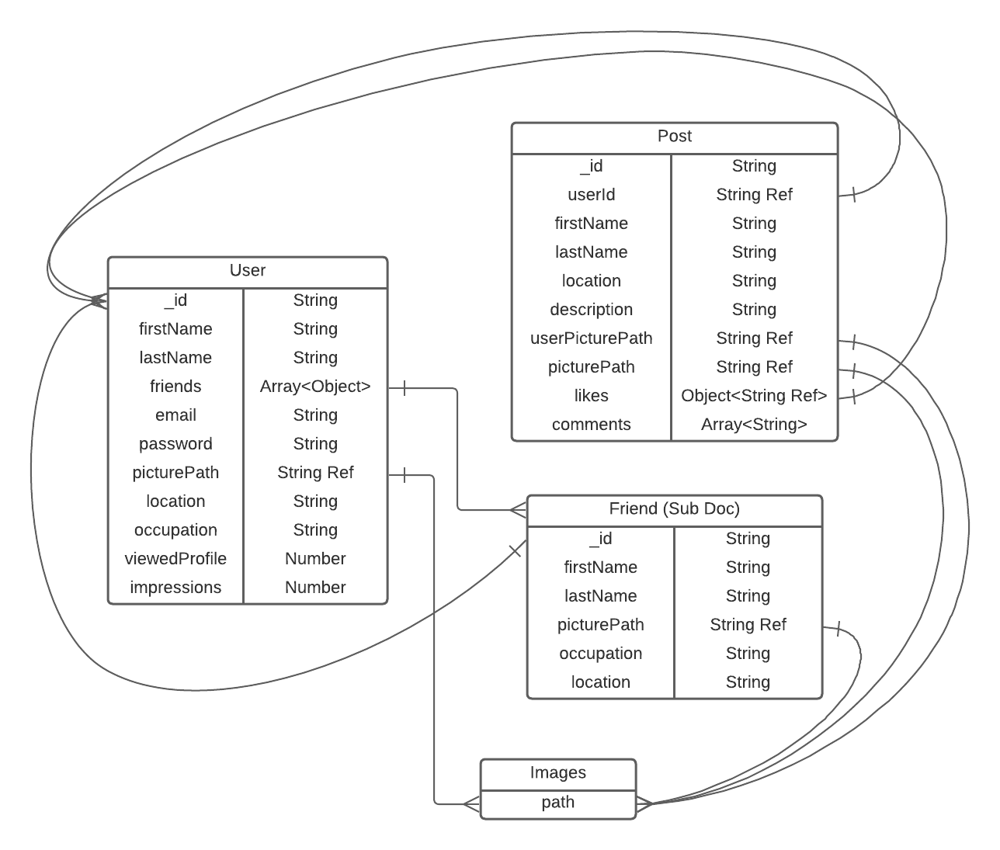

# Sociopedia
Full Stack Social Media Web App built with MERN

## Technologies used:

## Deployment:
- [Vercel Front-End Deployment](https://sociopedia-app.vercel.app)
- [DigitalOcean API Deployment](https://urchin-app-v2nci.ondigitalocean.app)

## Snapshot:

## MongoDB Schema:

## Acknowledgments

This project was created with the help of a [fantastic YouTube tutorial by EdRoh](https://youtu.be/K8YELRmUb5o?si=A-LMMf4fiOH9d71F). I highly recommend checking out his tutorial if you're interested in learning more about building similar projects.
